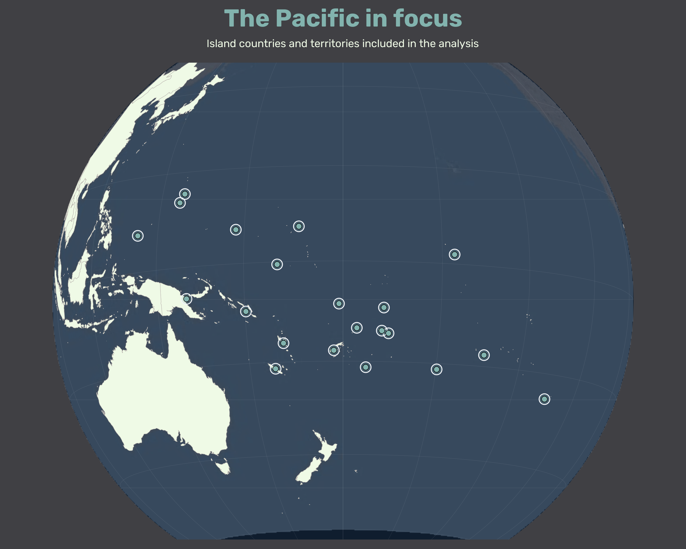
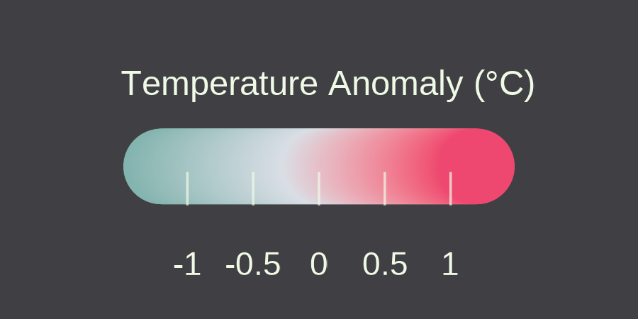
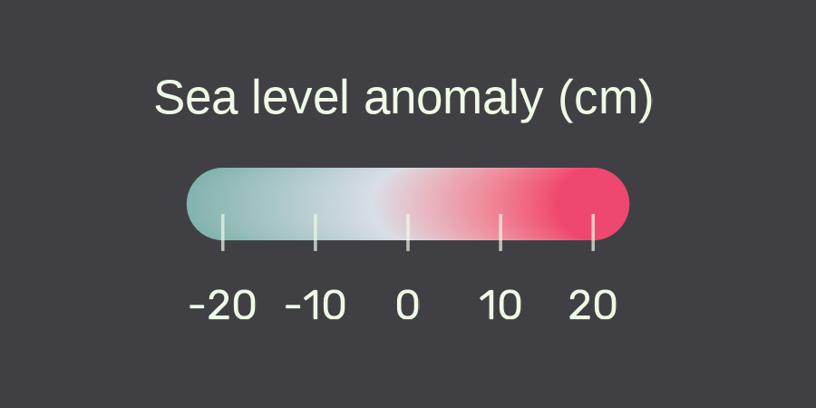

<!-- ======================================================= -->
<!-- INTRO                                                   -->
<!-- ======================================================= -->

:::{.cr-section}

:::{#cr-intro scale-by=".90"}

:::

:::{focus-on="cr-intro"}

# Hotter seas. Higher waters.

---

Across the Pacific, communities are experiencing a changing ocean — one that is becoming **warmer** and **higher**.

:::

:::

<!-- ======================================================= -->
<!-- CHAPTER 1 — SEA SURFACE TEMPERATURE — D3                -->
<!-- ======================================================= -->

:::{.cr-section}

:::{#cr-sst-d3 scale-by=".95"}

:::

:::{.sst-step data-year="1940" focus-on="cr-sst-d3"}

# A warming ocean

Read this chart on the right like a clock. Time starts at the top in **1920** and moves **clockwise** until 2020.

The graph below shows the number of territories with negative and positive anomalies over time.

Blue-green tones indicate cooler-than-average conditions, while pink tones indicate warmer-than-average conditions.

{.chart-legend}

  

:::

:::{.sst-step data-year="1960" focus-on="cr-sst-d3"}

## As the decades pass…

As the clock moves forward, cooler and near-average conditions still make up much of the picture.

But warmer anomalies are becoming more visible.

  

:::

:::{.sst-step data-year="1980" focus-on="cr-sst-d3"}

## Halfway around the clock

By 1980, warmer anomalies are appearing more frequently across the Pacific.

The balance between cooler and warmer conditions begins to shift.

  

:::

:::{.sst-step data-year="2000" focus-on="cr-sst-d3"}

## Warming becomes harder to miss

As the century approaches its end, positive temperature anomalies become increasingly common.

Pink begins to occupy more of the clock.

  

:::

:::{.sst-step data-year="2020" focus-on="cr-sst-d3"}

## A century of warming

By 2020, the circle tells a very different story from its beginning.

Across the Pacific, warmer-than-average ocean conditions have become increasingly common.

  

:::

:::

<!-- ======================================================= -->
<!-- CHAPTER 2 — SEA LEVEL — D3                              -->
<!-- ======================================================= -->

:::{.cr-section}

:::{#cr-sl-d3 scale-by=".95"}

:::

:::{focus-on="cr-sl-d3"}

# Rising seas

The same clock can be used to trace another change.

Here, each dot shows a Pacific territory’s sea level anomaly. The white ring marks zero anomaly. Points inside it represent negative anomalies, while points outside it represent positive anomalies.

{.chart-legend}

  

:::

:::{focus-on="cr-sl-d3"}

## Moving above zero

In the early part of the series, many observations remain close to the zero-anomaly ring.

As the years pass, more points begin to move beyond it.

  

:::

:::{focus-on="cr-sl-d3"}

## A changing pattern

Positive sea-level anomalies become increasingly common across the Pacific.

More observations now sit outside the zero reference ring.

  

:::

:::{focus-on="cr-sl-d3"}

## A rising ocean

By the end of the series, positive anomalies dominate the circle.

Across the Pacific, the ocean is not only warmer.

It is higher.

  

:::

:::

<!-- ======================================================= -->
<!-- CHAPTER 3 — CO2 — D3                                    -->
<!-- ======================================================= -->

:::{.cr-section}

:::{#cr-co2-d3 scale-by=".95"}

:::

:::{focus-on="cr-co2-d3"}

# A small contribution

Across the world, countries differ enormously in both per-capita emissions and their total contribution to global CO₂ emissions.

Each bubble represents a country or territory. Its position shows CO₂ emissions per person, while bubble size represents total annual emissions.

:::

:::{focus-on="cr-co2-d3"}

## The Pacif in context

Now the Pacific islands and territories come into view.

Their contribution to global emissions is small in absolute terms, even as many of them experience some of the most direct consequences of a warming and rising ocean.

:::

:::

<!-- ======================================================= -->
<!-- FINAL PAGE                                               -->
<!-- ======================================================= -->

::: {.final-page}

# About this project

This visualization was created for the **Pacific Dataviz Challenge 2026**.

## Github Repository

https://github.com/thais01fernandes/pacific-dataviz-challenge-2026

## My Profile

<a class="profile-link"
   href="https://www.linkedin.com/in/thfp/"
   target="_blank"
   rel="noopener noreferrer">
  
  Thais Fernandes
</a>

<a class="profile-link"
   href="https://github.com/thais01fernandes"
   target="_blank"
   rel="noopener noreferrer">
  
  thais01fernandes
</a>

:::

